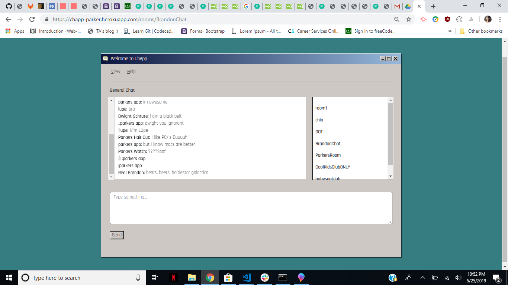

# ChApp

## Description
Hello welcome to ChApp. On this chat app you can enjoy chatting with your friends with a retro inspired design. Create your own screenname and then you have the options to chat on the default chatroom, choose one of the premade chatrooms, or create your own chatroom.

**Screenshot:**

Format: 

Below, I added a link of a video on how the app works.

**Video:**
https://drive.google.com/file/d/17lvSWUbYUaf6qUqzdj03UaSx

This was a collaboration between Yvette Montes, Parker Bjur, & Lupe De Alba

### Features
* Create a permanent or temporary chatroom
* Multi colored screennames
* FAQ's on the help tab.
* windows 98 inspired

### Future Features

* Create a chatroom with the option for it to be public or private
* Display users in the current room
